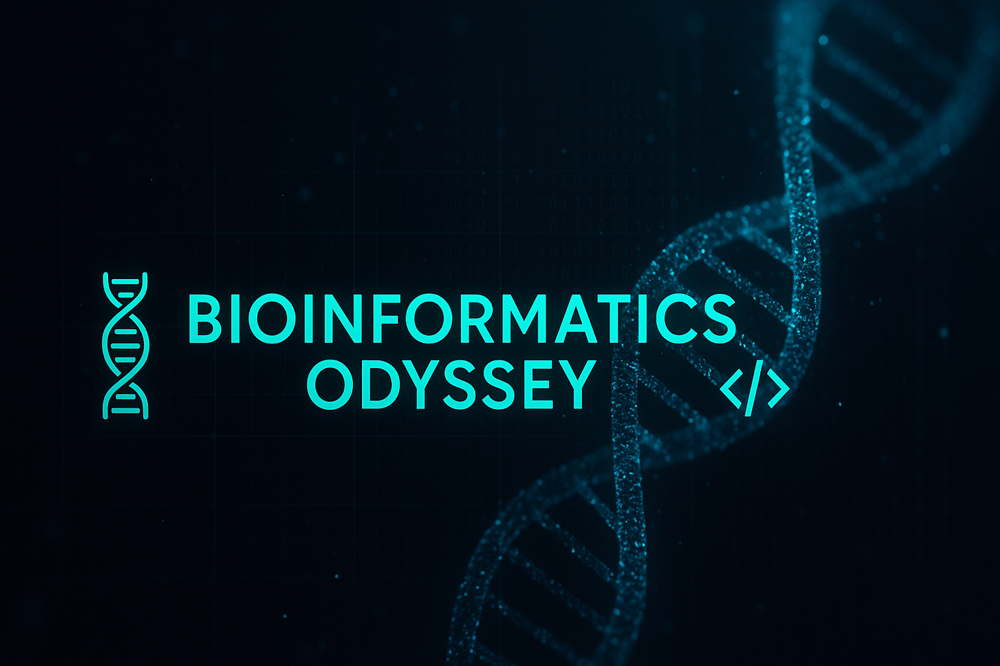

# 🧬 Bioinformatics Odyssey

*A hands-on learning journey into the world of DNA, code, and biological data.*

---
This repository is a personal lab notebook and coding space where I’m learning bioinformatics step-by-step through:

- Python scripting for biological problems  
- File formats like FASTA, FASTQ, and VCF  
- real-world applications and tools in genomics  
- Data parsing, visualization, and automation

Everything here reflects my **learning process**, not just finished projects — from basic file handling to parsing genomic data and beyond.  

🎯*Goal:* *Build strong foundations in bioinformatics and computational biology — one script at a time.*

🚀*Vision:* *A structured, hands-on path to mastering bioinformatics through small wins, clean code, and continuous learning.*

---
Stay curious, and feel free to follow along!🌱
